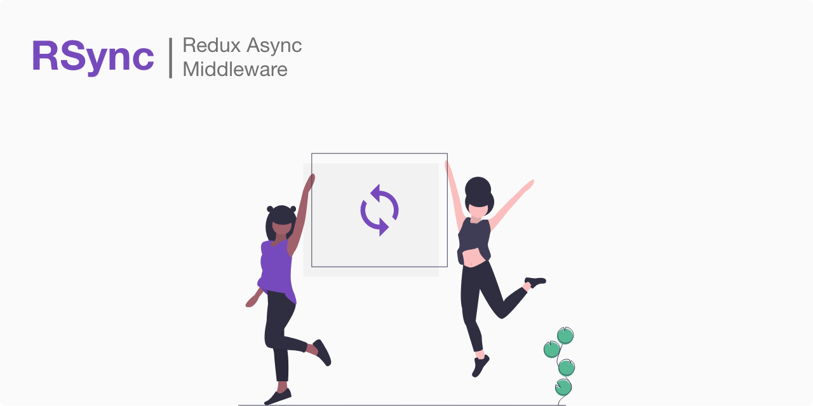

# RSync: Redux async middleware

[](https://github.com/adhyapranata/rsync)

[](https://codeclimate.com/github/adhyapranata/rsync)
[](https://opensource.org/licenses/MIT)

RSync is an alternative to redux-saga to handle async actions without generator syntax.
It makes handling complicated async flow easier and offers a great readability.

## Table of Contents

- [Demo](#demo)
- [Installation](#installation)
- [Getting Started](#getting-started)
- [Documentation](#documentation)
- [Contributing](#contributing)
- [Support + Feedback](#support--feedback)
- [License](#license)

## Demo
For a demo, [click here](https://github.com/adhyapranata/rsync-demo).

## Installation 

```bash
yarn add redux-rsync
```

## Getting Started

**1. Apply rsync middlware**

**`redux/index.js`**
```javascript
import rootReducer from './reducer'
import rsync from 'redux-rsync'
import { createStore, applyMiddleware } from 'redux'

export const store = createStore(
  rootReducer,
  applyMiddleware(rsync)
)
```


**2. Decorate actions with async or flow metadata**

**`redux/action.js`**. Use `async` for single asynchronous effect
```javascript
import api from '../api'

...
export function requestGetUser (payload) {
  return {
    type: 'REQUEST_GET_USER',
    payload,
    meta: {
      async: {
        effect: payload => api.user.show(payload),
        resolve: { type: 'RESOLVE_REQUEST_GET_USER' },
        reject: { type: 'REJECT_REQUEST_GET_USER' },
        take: 'latest'
      }
    }
  }
}
...
```

**`redux/flow.js`**. Use `flow` for chain/series of `async` effect
```javascript
import { requestGetUser, requestGetPosts } from './action'
import { loadInitialDataParams } from './prepare'

...
export function loadInitialData (payload) {
  return {
    type: 'LOAD_INITIAL_DATA',
    payload,
    meta: {
      flow: {
        actions: [
          {
            effect: requestGetUser,
            break: ({ response }) => !response.data.args.user
          },
          {
            effect: requestGetPosts,
            prepare: loadInitialDataParams.requestGetPosts
          }
        ],
        resolve: { type: 'RESOLVE_LOAD_INITIAL_DATA' },
        reject: { type: 'REJECT_LOAD_INITIAL_DATA' },
        take: 'every:serial'
      }
    }
  }
}
...
```

## Documentation

RSync works by decorating actions with `async` and/or `flow` metadata. `async` is a single asynchronous effect and `flow` is the chain/series of `async` effect.  

- [Async](#async)
- [Flow](#flow)

### Async

#### Example
```javascript
import api from '../api'

...
export function requestGetUser (payload) {
  return {
    type: 'REQUEST_GET_USER',
    payload,
    meta: {
      async: {
        effect: payload => api.user.show(payload),
        resolve: { type: 'RESOLVE_REQUEST_GET_USER' },
        reject: { type: 'REJECT_REQUEST_GET_USER' },
        take: 'latest'
      }
    }
  }
}
...
```

#### Properties

| Property          | Type     | Value                               | Description                                                                                                                                    |
| ----------------- | -------- | ----------------------------------- | ---------------------------------------------------------------------------------------------------------------------------------------------- |
| `effect`          | function | `payload => {...}`                  | Async side effect to run                                                                                                                       |
| `resolve`         | object   | `{ type: '<ACTION_NAME>' }`         | Will be dispatched if the effect execution is successful. Payload and effect result/response will be passed to the reducer automatically       |
| `reject`          | object   | `{ type: '<ACTION_NAME>' }`         | Will be dispatched if the effect execution is failed. Payload and error will be passed to the reducer automatically                            |
| `take`            | string   | `every:parallel`(default), `latest` | `latest`: if an action effect still running when another action with the same `type` is dispatched, then the previous action will be cancelled<br><br>`every:parallel`: take all dispatched actions |

### Flow

#### Example

`async.js`
```javascript
import api from '../api'

...
export function requestGetUser (payload) {
  return {
    type: 'REQUEST_GET_USER',
    payload,
    meta: {
      async: {
        effect: payload => api.user.show(payload),
        resolve: { type: 'RESOLVE_REQUEST_GET_USER' },
        reject: { type: 'REJECT_REQUEST_GET_USER' },
        take: 'latest'
      }
    }
  }
}

export function requestGetPosts (payload) {
  return {
    type: 'REQUEST_GET_POSTS',
    payload,
    meta: {
      async: {
        effect: payload => api.post.index(payload),
        resolve: { type: 'RESOLVE_REQUEST_GET_POSTS' },
        reject: { type: 'REJECT_REQUEST_GET_POSTS' },
        take: 'latest'
      }
    }
  }
}
...
```

`flow.js`
```javascript
import { requestGetUser, requestGetPosts } from './action'
import { loadInitialDataParams } from './prepare'

...
export function loadInitialData (payload) {
  return {
    type: 'LOAD_INITIAL_DATA',
    payload,
    meta: {
      flow: {
        actions: [ // will be executed in order
          {
            effect: requestGetUser,
            break: ({ response }) => !response.data.args.user
            // 'break' will receive response data from 'requestGetUser' and
            // you can decide to stop the flow here if you don't like the response
          },
          {
            effect: requestGetPosts,
            prepare: loadInitialDataParams.requestGetPosts
            // 'prepare' will receive response data from 'requestGetUser' and
            // you can process it for 'requestGetPosts' params
          },
          [
            // to execute multiple async actions in parallel, wrap them inside another array 
            {
              effect: doFoo,
              prepare: loadInitialDataParams.doFoo
            },
            {
              effect: doBar,
              prepare: loadInitialDataParams.doBar
            },
          ]       
        ],
        resolve: { type: 'RESOLVE_LOAD_INITIAL_DATA' },
        reject: { type: 'REJECT_LOAD_INITIAL_DATA' },
        take: 'every:serial'
      }
    }
  }
}
...
```

#### Properties

| Property          | Type                    | Value                                                                   | Description                                                                                                                                              |
| ----------------- | ----------------------- | ----------------------------------------------------------------------- | -------------------------------------------------------------------------------------------------------------------------------------------------------- |
| `actions`         | array[object/array]     | `[{ effect: () => {...}, ... }]`                                        | Array of actions to run. The action will support these following properties: `effect`, `prepare`, `break`<br><br>The actions will be executed in order. To run multiple actions at once, wrap them inside an array. (see example above)<br><br>`effect`: function that will return redux action with `meta:async` property. (see example above)<br><br>`prepare`: function to prepare result/response from previous async action into params for the current action<br><br>`break`: function to evaluate the result/response from the action. return `true` to stop the flow or return `false` to continue |
| `resolve`         | object                  | `{ type: '<ACTION_NAME>' }`                                             | Will be dispatched if the whole flow actions is successful. Effect result/response will be passed to the reducer automatically.                            |
| `reject`          | object                  | `{ type: '<ACTION_NAME>' }`                                             | Will be dispatched when one of the flow action is failed. Error will be passed to the reducer automatically.                                                 |
| `take`            | string                  | `first`(default), `every:serial`                                        | `first`: will not accept any flow actions with the same `type` with the one that currently running unti it's done<br><br>`every:serial`: take all dispatched flow actions with the same `type`, put them in a queue and execute them in serial  |

## Contributing

We appreciate feedback and contribution to this repo! Before you get started, please see the following:

- [This repo's contribution guide](CONTRIBUTING.md)

## Support + Feedback

- Use [Issues](https://github.com/adhyapranata/rsync/issues) for code-level support
- Use [Mail](mailto://adhyapranata@wingtrail.com) for usage, questions, specific cases

## License

[MIT](LICENSE)
